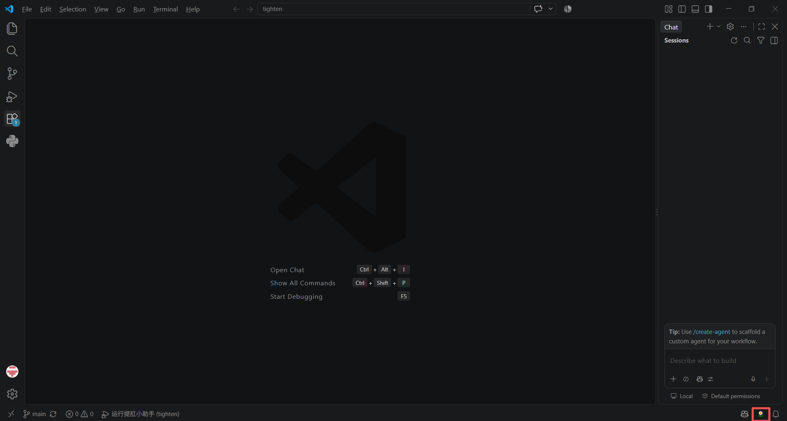
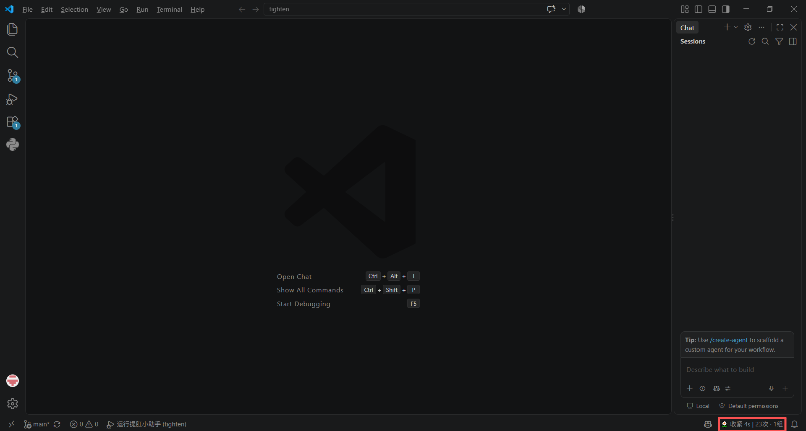

# 🌼 提肛小助手

一个运行在 VS Code 状态栏中的提肛练习计时器，支持自定义练习节奏，并自动记录每日完成次数和组数。

## 主要功能

- 点击右下角状态栏中的 `🌼` 开始或停止练习。
- 默认节奏：收紧 4 秒 → 放松 4 秒，两个阶段的时长可以分别配置。
- 每完成一次收紧，今日次数加 1。
- 默认每完成 20 次收紧计为 1 组，完成一组后自动停止。
- 练习次数和组数会持久化保存，重启 VS Code 后仍然保留。
- 根据本地日期自动切换，每天重新开始统计。
- 支持通过命令面板清零今日统计。

## 界面预览

| 未启动前 | 提肛中 |
| --- | --- |
|  |  |

## 快速开始

### 开发模式

环境要求：VS Code 1.85.0 或更高版本、Node.js 和 npm。

1. 克隆或下载本项目。
2. 在项目目录安装依赖：

   ```powershell
   npm install
   ```

3. 使用 VS Code 打开项目。
4. 按 `F5` 启动扩展开发宿主窗口。
5. 点击右下角状态栏的 `🌼` 开始练习。

练习中再次点击状态栏项目即可提前停止；完成一组后会自动停止。

### 命令面板

按 `Ctrl + Shift + P` 打开命令面板，可执行：

- **提肛小助手：开始/停止练习**
- **提肛小助手：清零今日统计**

## 配置

在 VS Code 设置中搜索“提肛小助手”，或直接编辑 `settings.json`：

| 配置项 | 默认值 | 范围 | 说明 |
| --- | ---: | ---: | --- |
| `tigangHelper.repetitionsPerSet` | 20 | 1–1000 | 完成多少次收紧计为一组 |
| `tigangHelper.tightenDurationSeconds` | 4 | 1–60 | 每次收紧持续的秒数 |
| `tigangHelper.relaxDurationSeconds` | 4 | 1–60 | 每次放松持续的秒数 |

示例：

```json
{
  "tigangHelper.repetitionsPerSet": 20,
  "tigangHelper.tightenDurationSeconds": 4,
  "tigangHelper.relaxDurationSeconds": 4
}
```

## 打包安装

在项目目录执行：

```powershell
npm install
npx vsce package
```

生成 `.vsix` 文件后，在 VS Code 扩展页面中选择“从 VSIX 安装”。

## 开发检查

```powershell
npm run check
```

## 许可证

本项目使用 MIT License。

> 本扩展仅提供计时和记录功能，不构成医疗建议。如有疼痛或不适，请停止练习并咨询专业人士。
